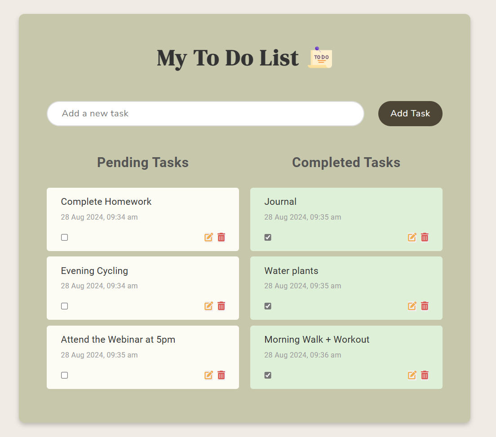

# Future Intern Internship Projects
<h2>Project 1 : Calculate Me - Web Calculator</h2>

Web-based calculator that can perform basic arithmetic operations.

Live at : <a href="https://calculateme-webcalculator.netlify.app/">Calculate Me</a>
 

  
<h2>Project 2 : To - Do Web App</h2>

My To-Do Web App is a simple and efficient tool for managing tasks. Built with HTML, CSS, and JavaScript, it provides a responsive design that works well on desktops, tablets, and mobile devices.

Key Features: 

<ol>
    <li><b>Task Addition</b>
    Users can easily add tasks by typing in the input field and clicking the "Add Task" button or pressing "Enter." New tasks appear in the "Pending Tasks" section with a timestamp.
    </li>
    <li><b>Task Completion</b>
    Each task includes a checkbox to mark it as completed. Completed tasks move to the "Completed Tasks" section, with a background color change to signify completion.
    </li>
    <li><b>Task Editing</b>
    Users can edit tasks by clicking the "Edit" button (pencil icon). A prompt allows modification of the task description, and the timestamp updates if the task's completion status changes.
    </li>
    <li><b>Task Deletion</b>
    Tasks can be deleted by clicking the "Delete" button (trash icon), immediately removing them from the list.
    </li>
</ol>

Live at : <a href="https://todo-daily-journal.netlify.app/">My To-Do App</a>
 

